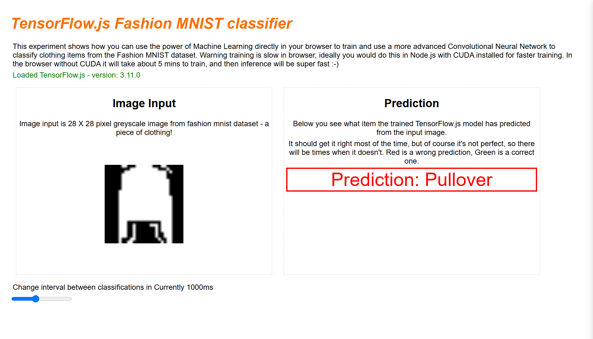

# TensorFlow.js MNIST Image Classifier

This project is a web-based digit classifier built using TensorFlow.js and the MNIST dataset. It classifies hand-drawn digits (0-9) by predicting the number displayed in the image input. The application leverages TensorFlow.js to load, process, and classify images in real time within the browser.

 
 

## Table of Contents
- [Overview](#overview)
- [Features](#features)
- [Demo](#demo)
- [Installation](#installation)
- [Usage](#usage)
- [Project Structure](#project-structure)
- [Technical Details](#technical-details)
- [Credits](#credits)
- [License](#license)

## Overview
This project utilizes the TensorFlow.js library to load a pre-trained model that can classify images of handwritten digits from the MNIST dataset. The classifier predicts the digit displayed in a 28x28 pixel grayscale image, with correct predictions highlighted in green and incorrect predictions in red.

## Features
- **Real-time prediction:** Provides instant feedback on digit predictions.
- **Color-coded predictions:** Green text indicates correct predictions, while red text indicates incorrect predictions.
- **Browser-based model:** Built entirely in JavaScript using TensorFlow.js, making it platform-independent and easy to use.

## Demo
You can view the live demo of the project at [Your Demo Link Here](https://your-demo-url.com).

## Installation

### Prerequisites
- Ensure you have a modern web browser that supports JavaScript and TensorFlow.js.
- Internet connection to load TensorFlow.js library and model data.

### Steps
1. Clone this repository:
   ```bash
   git clone https://github.com/bozics_chucky/tensorflowjs-mnist-classifier.git
   cd tensorflowjs-mnist-classifier
